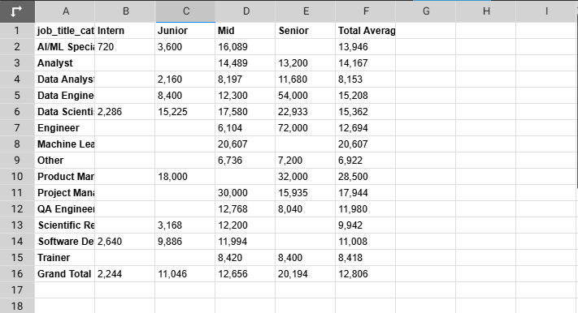
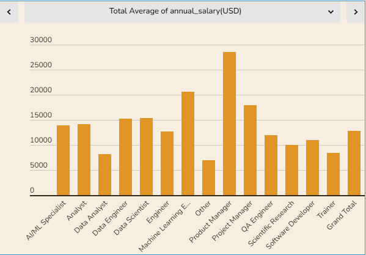
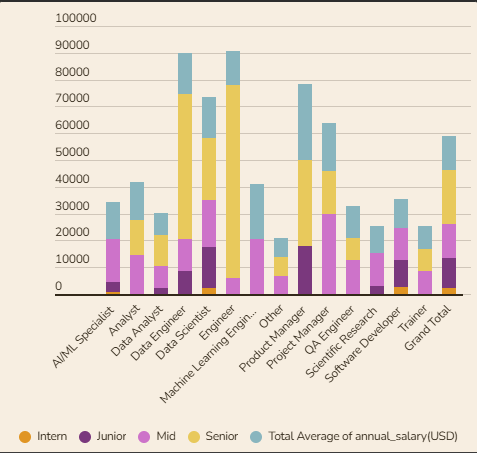
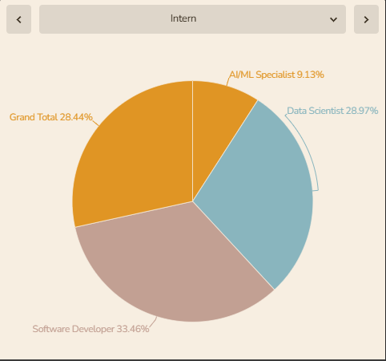

# T-tech skills Matrix analysis

This project visualizes the relationship between tech skills, career levels, and annual salaries, as well as performance metrics such as job satisfaction, skill proficiency, and career growth opportunities.

## Description

This analysis was done to gain insights that would be useful in the future. The study aims to;

- Identify the most in-demand tech skills and their corresponding salary ranges across different career levels.
- Determine how performance metrics influence annual salary for each tech skill and career level combination.
- Visualize the career progression and salary growth opportunities for tech professionals with various skill sets.
- Inform hiring decisions, talent development programs, and compensation strategies in the tech industry.

## Data

- A list of tech skills categorized by programming languages, development frameworks, databases, cloud platforms, cybersecurity, and data science.
- A list of career levels, including intern, junior, mid-level, and senior.
- Annual salary ranges for each career level and tech skill combination.
- Performance metrics for each career level and tech skill combination.

   

## Tools utilized

- Ms. Excel was used to collate the dataset: [**Excel**](https://www.microsoft.com/en-us/microsoft-365/excel)
- Power BI was used for data cleaning, transforming and visualization: [**Power BI**](https://www.microsoft.com/en-us/download/details.aspx?id=58494)

## Data visualization 

    

## Recommendations

Based on the insights and analysis, here are some recommendations to T-tech operations on how to improve:

1. *Upskilling and Reskilling*: Invest in training programs that focus on emerging technologies like cloud computing, cybersecurity, and data science. This will enhance the skills of mid-level and senior employees, improving overall performance.

2. *Career Development*: Establish a clear career progression path for employees, providing opportunities for growth and advancement. This will increase job satisfaction and retention rates.

3. *Diversity and Inclusion*: Foster a culture of diversity and inclusion, encouraging representation from diverse backgrounds and skill sets. This will bring unique perspectives, driving innovation and growth.

4. *Performance Metrics*: Revise performance metrics to include not only salary but also factors like job satisfaction, skill proficiency, and career growth opportunities. This will provide a more comprehensive understanding of employee performance.

5. *Compensation Packages*: Review compensation packages to ensure they are competitive and aligned with industry standards. This will attract and retain top talent.

6. *Mentorship Programs*: Establish mentorship programs pairing experienced professionals with junior employees. This will facilitate knowledge sharing, skill development, and career growth.

7. *Innovation and R&D*: Allocate resources to research and development, encouraging innovation and experimentation. This will drive growth, improve performance, and attract top talent.

8. *Employee Engagement*: Foster an engaging work environment through regular feedback, recognition, and rewards. This will boost job satisfaction and motivation.

9. *Industry Partnerships*: Collaborate with industry leaders and startups to stay updated on emerging trends and technologies. This will enhance T-tech's reputation and attract new talent.

10. *Data-Driven Decision Making*: Leverage data analytics to inform strategic decisions, ensuring data-driven insights guide operations and growth strategies.

By implementing these recommendations, T-tech operations can enhance performance, drive growth, and become a more attractive employer in the industry.

